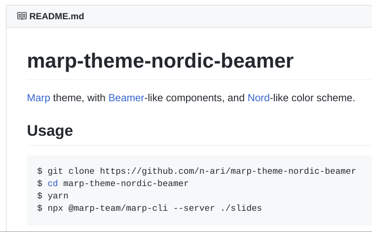

<!-- _class: title -->
# marp-theme-nordic-beamer

## Marp theme,
## with Beamer-like components,
## and Nord-like color scheme

created by @n-ari.

---

# marp-theme-nordic-beamer とは

marp-theme-nordic-beamer とは、Marp の default テーマをベースとし、Beamer で使われるブロック等を導入した、Nord ライクな配色のテーマ・エンジンです。
Marp を拡張し、ブロック等を導入することで、ゼミなどで使いやすくしています。

## 使い方

```sh
$ git clone https://github.com/n-ari/marp-theme-nordic-beamer
$ cd marp-theme-nordic-beamer
$ yarn
$ npx @marp-team/marp-cli --server ./slides
```

`marp.config.js` にて Marp を拡張しているため、`marp.config.js` の存在するディレクトリで marp-cli を実行する必要があります。
クローン時のディレクトリ名は好みに応じて変更してください。

---

<!-- header: 'marp-theme-nordic-beamer' -->
<!-- footer: 'デモスライド' -->
# デモスライド

オイラーの定理とは、フェルマーの小定理の拡張であり、以下の通りである。

:::info:定理 1(オイラーの定理).
$n$ を正の整数とする。$a$ を $n$ と互いに素な正の整数とする。このとき、
$$a^{\varphi(n)} \equiv 1 \pmod n$$
が成り立つ。ただしここで、$\varphi(n)$ はオイラーのトーシェント関数である^†^。
:::

:::warn:注意
オイラーのトーシェント関数 $\varphi(n)$ は、$a^x\equiv 1\pmod n$ なる $x$ として最小のものを与えるわけではない。最小のものを与える関数としてカーマイケル関数 $\lambda(n)$ が存在し、これを **カーマイケルの定理** と呼ぶ。
:::

:::footnote
†: 特に素数 $p,q$ を用いて $n=pq$ である時、$\varphi(n) = (p-1)(q-1)$ である。
:::

---

<!-- header: 'ブロック構文' -->
<!-- footer: '' -->
# ブロック構文 (markdown-it-container による拡張)

:::info
インフォブロック :information_source:
Block for Information (info / blue)
:::
```md
:::info
インフォブロック :information_source:
Block for Information (info / blue)
:::
```

:::warn:Warning
ワーニングブロック :warning:
Block for Warning (warn / red)
:::
```md
:::warn:Warning
ワーニングブロック :warning:
Block for Warning (warn / red)
:::
```

---

# ブロック構文 (markdown-it-container による拡張)

:::block:ブロック
タイトル付きブロック(黒)
Block with Title (block / black)
:::
```md
:::block:ブロック
タイトル付きブロック(黒)
Block with Title (block / black)
:::
```

:::block
ブロック
Block only (block / black)
:::
```md
:::block
ブロック
Block only (block / black)
:::
```

---

<!-- header: 'emoji' -->
<!-- footer: '' -->
# emoji

本家 Marp 同様、twemoji による emoji が使えます :tada:

---

<!-- header: '画像' -->
<!-- footer: 'class: (default)' -->
# 画像

画像はデフォルトで中央寄せです。



---

<!-- header: '画像(左寄せ)' -->
<!-- _footer: 'class: image-left' -->
<!-- _class: image-left -->
# 画像(左寄せ)

`class: image-left` を指定することで画像が左寄せになります。


---

<!-- header: '画像(右寄せ)' -->
<!-- _footer: 'class: image-right' -->
<!-- _class: image-right -->
# 画像(右寄せ)

`class: image-right` を指定することで画像が右寄せになります。


---

<!-- header: '画像(bg)' -->
<!-- footer: 'Footer space' -->
# 画像(bg)

`` 等によって背景画像を設定できます。

背景画像はスライド全体に広がるため、デフォルトスライドで `# h1` を用いる場合は上部が見切れる点に注意してください。

Lorem ipsum dolor sit amet, consectetur adipiscing elit, sed do eiusmod tempor incididunt ut labore et dolore magna aliqua. Ut enim ad minim veniam, quis nostrud exercitation ullamco laboris nisi ut aliquip ex ea commodo consequat. Duis aute irure dolor in reprehenderit in voluptate velit esse cillum dolore eu fugiat nulla pariatur. Excepteur sint occaecat cupidatat non proident, sunt in culpa qui officia deserunt mollit anim id est laborum.


---

<!-- _header: '' -->
# 画像(bg right)

`` 等によって画面の一部を画像で埋めることが出来ます。

foreignObject 外にはみ出る影響で header / footer が正しく描画されないため、`<!-- _header: '' -->` 等の指定をすることで表示を消すのがおすすめです。

このページでは header を非表示にし、footer を設定しています。


---

<!-- header: 'Header space' -->
# 画像(bg left)

``

このページでは header / footer をそれぞれ設定しています。


